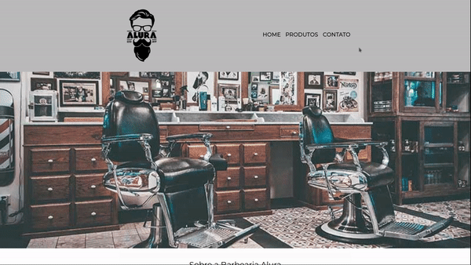
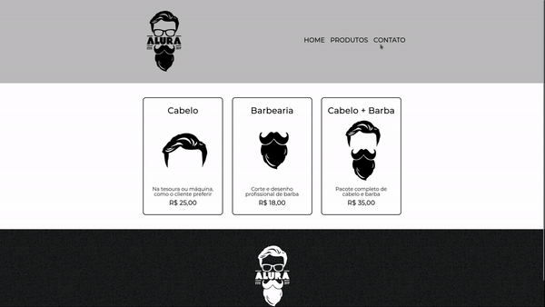

# Barbearia Alura

Projeto feito no curso do [Alura](https://www.alura.com.br/) na formação de Front-End nos cursos HTML5 e CSS3 partes de 1 a 4 ministrado por [Pedro Marins](https://github.com/pedromarins), utilizando as linguagens e as aplicado com seus principios. O projeto tem por obejtivo a prática desses fundamentos e conhecimentos de base do HTML e CSS.

 

## 🧪 Preview do Projeto 

- ### Página Principal:

    

- ### Página de Produtos:

    

- ### Página de contato:

    

  
## 🚀 Tecnologias

Esse projeto foi desenvolvido com as seguintes tecnologias:

- [HTML5](https://www.w3schools.com/html/)
- [CSS3](https://www.w3schools.com/css/default.asp)

## 💻 Projeto

O projeto em questão é um simples site portifolio que visa realizar a divugação de uma barearia fictícia.

---

Feito com 💙 por Joadson Silva.
